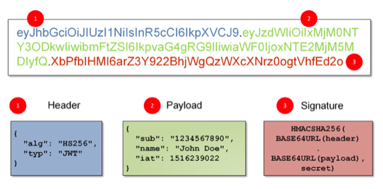
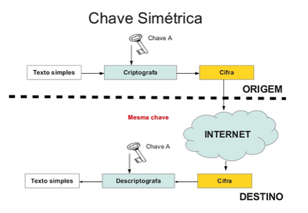
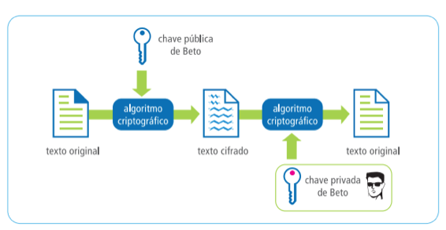
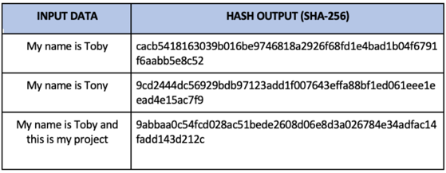
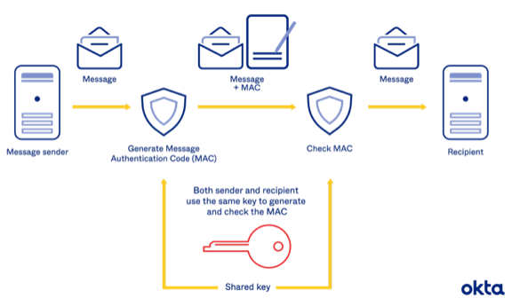

### JWT - Json Web Token

---

### O que é JWT?

O JWT é um padrão da Internet para a criação de tokens de acesso baseados em JSON; 

O JWT é um token gerado a partir de dados de um determinado usuário como id, login, níveis de acesso na aplicação, etc.

---

### O que é JWT?

---

### Criptografia

- Simétrica
- Assimétrica

---

### Criptografia Simétrica

Algoritmos de criptografia simétrica utilizam um segredo, como uma senha, para criptografar uma determinada mensagem 

---

### Criptografia Simétrica

O resultado do processo de criptografia é uma sequência de bytes "embaralhados" pelo algoritmo escolhido para realizar essa criptografia.

---

### Criptografia Simétrica

---

### Criptografia Assimétrica

A criptografia assimétrica, por sua vez, utiliza o que conhecemos como par de chaves.

---

### Criptografia Assimétrica

Esse par de chaves consiste em duas "senhas", que chamamos de chaves. Dessas duas chaves, uma é pública, e deve ser conhecida por qualquer pessoa.

A outra chave é a chave privada, que deve ser conhecida somente pela pessoa que gerou o par de chaves.

---

### Criptografia Assimétrica

---

### Hash

Além de entender o que é criptografia, precisamos entender o que é um hash: hash é um algoritmo que, dado um input de qualquer tamanho, gera um output com um tamanho fixo.

---

### Hash

O processo é, por definição, one-way, o que quer dizer que ele não pode ser revertido.

---

### Hash

---

### HMAC

O HMAC é um algoritmo para gerar um MAC (código de autenticação de mensagem) criptografado através de algum algoritmo de hash (algoritmos que codificam mensagens) como md5, sha1 ou sha256, a partir de um segredo (como uma senha) e de uma mensagem qualquer.

---

### HMAC

---

### Dúvidas

---

### JWT

Bora codar?